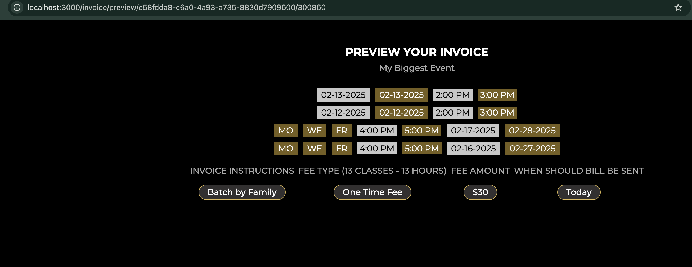

# Application Routes Documentation

## Main Routes

1. `/` 
   - Redirects to `/event`
   - Purpose: Default landing redirect
    

2. `/main`
   - Renders: `buttons.hbs`
   - Purpose: Dashboard view with navigation buttons to create events, add messages, and view all events
   

## Event Routes

1. `/event`
   - Method: GET
   - Renders: `create-event.hbs`
   - Purpose: Create new event form
   - Screenshot Already Attached In Upper Section

2. `/event`
   - Method: POST
   - Purpose: Handle event creation with file uploads
   - Screenshot Already Attached In Upper Section

3. `/event/all`
   - Renders: `all-events.hbs`
   - Purpose: Display list of all events for the creator
   

4. `/event/edit/:eventId`
   - Renders: `edit-event.hbs`
   - Purpose: Edit existing event form
   

5. `/event/add-message`
   - Renders: `add-message.hbs`
   - Purpose: Form to add messages to existing events
   

6. `/event/add-message/:id`
   - Method: POST
   - Purpose: Handle adding messages to existing events
   - Type: API (No Screenshot)

7. `/event/fetch-contact-group-members/:id`
   - Purpose: API endpoint to get members of a contact group
   - Type: API (No Screenshot)

8. `/event/fetch-contacts/:email`
   - Purpose: API endpoint to fetch contacts by email
   - Type: API (No Screenshot)

9. `/event/:id`
   - Purpose: Get specific event details
   

10. `/event/uniqueEventId/:id`
    - Purpose: Get event details using unique identifier
    - Type: API 
    - Error: Not working giving Internal Server Error
    

11. `/event/list`
    - Renders: `list.hbs`
    - Purpose: Display all events in a table format with download options
    - Error: Not working giving SyntaxError: Unexpected token o in JSON at position 1
    

12. `/the-event/:id`
    - Renders: `single-event.hbs`
    - Purpose: Display detailed view of a single event
    - Error: Not working giving 404 error no view found
    
    

## Chat Routes

1. `/chat/:eventId/:userId`
   - Renders: React app for chat interface
   - Purpose: Event group chat functionality
   
## Invoice Routes

1. `/invoice/:eventId`
   - Renders: Invoice creation page
   - Purpose: Generate new invoice for an event
   

2. `/invoice/preview/:eventId/:invoiceId?`
   - Purpose: Preview generated invoice
   
   

3. `/invoice/invoice-pdf/:eventId/:invoiceId?`
   - Purpose: Generate PDF version of invoice
   

4. `/invoice/generate/:eventId`
   - Method: POST
   - Type: API  (POST)
   - Purpose: Handle invoice generation
     No Screenshot Available

## Location Routes

1. `/location/get-address-options`
   - Purpose: API endpoint for address autocomplete
   - Type: API
     No Screenshot Available

2. `/location/get-address-details/:placeId`
   - Purpose: API endpoint to fetch detailed address information
   - Type: API
     No Screenshot Available

## User Routes

1. `/user/:id`
   - Purpose: Get user information
   

2. `/user/:id/notification-preference`
   - Method: PUT
   - Purpose: Update user notification preferences
   - Type: API
     No Screenshot Available

## Notes:
- Many routes support file uploads through `multer` middleware
- Authentication/Authorization details are not visible in the provided code
- Some routes handle both API responses and view rendering based on context
- The chat functionality uses a combination of Express routes and Socket.IO